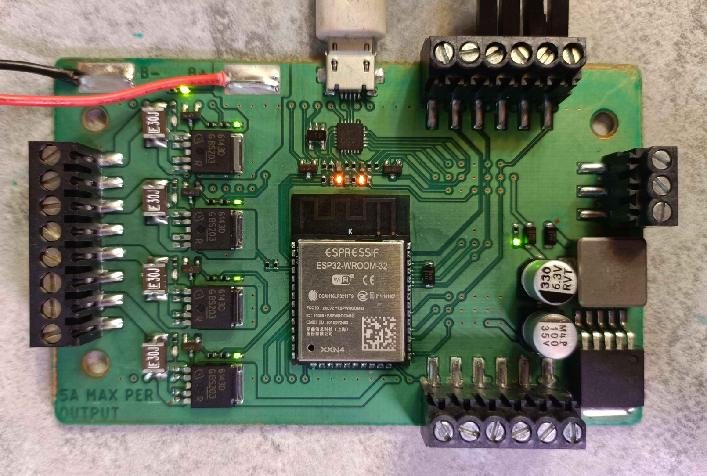
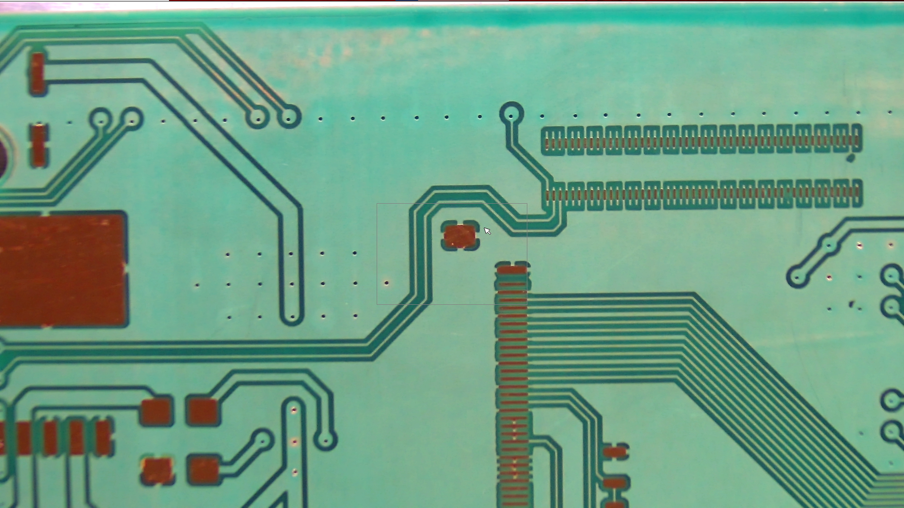
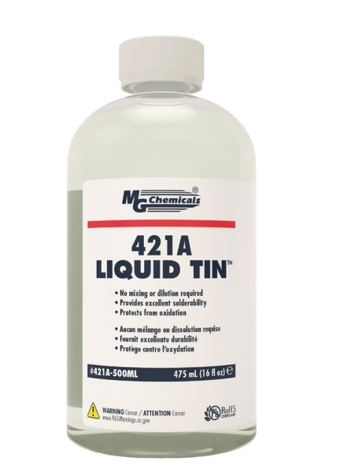

# Viagrid

Viagrid is a PCB template that allows for rapid PCB prototyping with 2-layer boards and factory-made vias. The blank boards have a standardized array of vias already in them; you just select which net they're connected to by cutting out the front and back layers of your board.

## Table of Contents
[File Prep](#file-prep) 
[Design](#design) 
[File Export](#file-export) 
[Fabrication Methods](#fabrication-methods)
  

When doing board layout, you drop your components onto the Viagrid template file. This shows you where the Viagrid blank already has vias embedded. When routing your board, simply drop your vias only where the Viagrid blank already has them.

When it comes time to fabricate your board, you only have to remove copper from the top and bottom layers, effectively deciding which net the vias are part of. This process can be done using UV DPSS lasers, chemical etching or CNC machining.

## File Prep

> [!NOTE]
> Viagrid has templates and instructions for only KiCAD and Eagle at the moment.

## Design

1. Design your schematic in KiCAD like you usually would. Assign footprints.
2. Before opening the .kicad_pcb file associated with your project, copy the `viagrid-template.kicad_pcb` file into your KiCAD project directory, and rename it to replace the default one.
3. Open the newly renamed `.kicad_pcb` file in KiCAD. The `User1` layer shows the location of the vias on the Viagrid blank, and the outer bounds of the usable area.
4. Set your board settings for best results:
   1. Vias: 1.5mm ring, 0.3mm drill
   2. Traces: no smaller than 0.2mm
   3. Copper pour: at least 0.3mm clearance
5. Route your board like you normally would.

## File Export

1. File -> Plot
2. When exporting, we only care about the front and back copper layers, and the front and back mask layers. Select these.
3. Export files as .DXF

## Fabrication Methods

[UV DPSS Laser Engraving](#uv-dpss-laser-engraving) 
[Chemical Etching](#chemical-etching) 
[CNC Machining](#cnc-machining) 
 

### UV DPSS Laser Engraving

Viagrid boards can be easily and autonomously cut using a UV DPSS (Diode Pumped Solid State) laser. These are commercially available and getting cheaper by the year. These instructions were prepared using a [Commarker Omni 1 (5W)](https://store.commarker.com/products/omni-1-uv-laser-engraver) however the same company has recently released a similar machine that is fully enclosed, called the [Omni X](https://store.commarker.com/products/omni-x-uv-laser-engraver).

> [!WARNING]
> We are asking a lot of this laser for this application. Any slight alignment error can result in inconsistent results across the work area.
> In my case, the laser galvo head was ever so slightly at an angle relative to the work area, which caused my cuts to be clean in one area, but barely work in others.
> To rectify this, I recommend barely loosening the three screws holding the galvo head onto the laser body, rotating the head until both sides are the same height from the work area, then tightening back down. I saw marked improvement to cutting performance after performing this adjustment.

#### Laser Prep

1. Print and assemble the alignment jig. Refer to the BOM in the relevant jig folder in this repository.
2. Mount to the laser base using M5x16mm bolts.
3. Mount a viagrid blank into the jig.
4. Connect the laser to your computer and follow manufacturer instructions for setup in Lightburn, including setting focus, scale, and Z-height.
5. Open the `viagrid.lbrn2` file in Lightburn.
6. Click the purple rectangle showing the outline of the viagrid copper pour (on layer 25).
7. Check `Output` next to layer 25, and then click the frame button.
8. Your laser should now be tracing this rectangle. Confirm that you see it tracing in a blue color. Use the visualization panel that comes with the laser if needed.
9. It's likely that the tracing is very far off from where the actual viagrid board is. If so, select the purple and brown rectangles and move them on the work area and frame again until you're within a few millimeters of the board's actual location.
10. Select the purple and brown rectangles, right click, and lock them.
11. Loosen the four gold thumbscrews on the alignment jig. You can now do fine adjustment to get the laser framing perfectly aligned with the Viagrid board. The board's corners are designed to have a small path of exposed FR4 that will illuminate when it's perfectly aligned. Adjust until you get all four corners of the Viagrid blank to light up, as shown below.

    

> [!WARNING]
> If you're feeling like it's impossible to get the rectangle perfectly illuminating in all four corners, it's likely you need to recalibrate your lens, or adjust the scale of your laser.

1.  Tighten down the thumbscrews.
2.  The alignment jig is now calibrated to your Viagrid lightburn job. Save the job and use this for all future etchings.

#### Running a job

1. Drop in top copper DXF file.
2. Make sure your imported board is the right size (90mm x 55mm)
3. Make inner bits layer 1, outer ring layer 30.
4. Group it.
5. Snap it onto locked outline.
6. Cut layer one with settings:

    - Speed: 100mm/s
    - Frequency: 35kHz
    - Q-Pulse Width: 1ns
    - Global Passes: 1
    - Mode: Fill
    - Line Interval (mm): 0.025
    - Scan Angle: 45deg
    - Number of Passes: 15
    - Angle Increment: 37deg
    - Fill all shapes at once: checked

7. Stop after layer one, and double check alignment. Are all your vias aligned with the traces?
8. Stop part way through and check, is your laser beefy and you're already done? Monitor the first job and how many passes you actually need to get through.
9. When done, remove from jig.
10. Sand down with 600 grit.
11. Inspect traces under a microscope and using a multimeter to ensure proper electrical isolation for all traces.

    

12. Put back in jig upside down
13. Get back copper in there, make sure it's flipped!
14. Cut the back side.

### Chemical Etching

 

#### Achieveable Results:
- *3mil traces.*
- *3mil spaces.*
- *Soldermask possible.*
- *Through-hole NOT possible.*
- *Flexible PCBs possible.*
- *Total average time from gerber to bare double-sided PCB: 20 minutes.*
- *Total average time from gerber to double-sided PCB with glossy soldermask (PET sheet): 25 minutes.*
- *Total average time from gerber to double-sided PCB with matte soldermask (tack dry): 90 minutes.*

#### *This documentation is a work in progress and is subject to change. Additional information and photos will be added over time.*

#### Overview

To start off with, you don't have to be an electronics or chemical engineer to chemical etch your own PCBs at home or small business. It's easy and safe if you are careful, if you can follow instructions and if you take your time. With that said:

> [!WARNING]
> Chemical etching of any PCB does require the use of certain chemicals which can be unsafe if not handled and disposed of properly. Generally, these will be FeCl3 (ferric chloride), NaOH (sodium hydroxide, commonly known as lye) and liquid tin. Do not mix chemicals, and always wear the proper PPE and follow all handling instructions recommended by the manufacturers of the equipment and chemicals you are using!

Na2CO3 (sodium carbonate) is also used, but is quite safe (it's basically just soda ash/powder laundry detergent).

Chemical etching of PCBs can be broken down into these steps:

- Create artwork masks for copper layers and place on UV photoresist-coated PCB (otherwise known as presensitized PCB).
- Expose UV photoresist-coated PCB to sufficient UV light for each copper layer to "burn" the artwork into the photoresist.
- Develop the PCB in diluted **Na2CO3** to remove areas of the photoresist coating, exposing the copper areas that we want to remove.
- Chemical etch the PCB in **FeCl3** to remove the copper areas that are now exposed after development.
- Strip the PCB of the rest of the photoresist coating in diluted **NaOH** to expose the copper.
- (Optional) Coat the PCB in UV soldermask on both sides.
- (Optional) Use a laser or follow UV artwork masking steps to tack dry and develop soldermask.
- (Optional) Repeat soldermask steps for more colors or to add silkscreen art.
- (Optional) Use HASL equipment or liquid tin to plate any exposed copper with a layer of tin or solder, to prevent corrosion and aid soldering.

> [!NOTE]
> When handling PCBs coated in UV photoresists or soldermasks, it is important to limit unintended exposure to UV as much as possible. It is recommended to work in a room lit with incandescent bulbs or white LED lighting. Sunlight, halogen bulbs and incandescent bulbs put out enough UV to cure photoresist in only a few minutes. For extended handling periods, it is recommended to install UV-free LED bulbs, such as the yellow "bug-free" bulbs that are generally available.

#### Photoresist and Artwork Masks

 

When chemically etching PCBs, a protective layer must exist over the copper areas we wish to keep. This is accomplished with a UV-sensitive acrylic polymer film, otherwise known as a UV photoresist. Both negative and positive photoresists exist. In simple terms, negative photoresist will "harden" when exposed to UV light, so the light must hit the areas of copper we wish to keep. Positive photoresist will "soften" when exposed to UV light, so the light must hit the areas of copper we wish to remove. Both types of coatings can achieve excellent detail and resolution if properly applied and exposed, and will never be the limiting factor for the quality of your DIY PCBs. Photoresist films are capable of tenting even large holes (>= ⌀5mm) and will easily protect the vias from etching.

Opulo-supplied Viagrid blanks can be used for chemical etching, but you must add this coating yourself, as they ship with ENIG plating and are intended primarily for use with laser etching.

A UV photoresist coating can be applied using standard UV photoresist films acquired from electronics suppliers or (less reliably) from markets such as Amazon, eBay and AliExpress. A thermal laminator and some patience is required for this method, but it can produce good results. Alternatively, aerosol-based spray cans of UV photoresist are also available, such as POSITIV 20. These are easier to apply, but cost significantly more, and require more care to get an even coating thickness. Ideally, you want a coating or film thickness of around 35µm. Almost all generally available photoresist coatings and films are negative photoresists, while most presensitized PCB blanks from vendors such as MG Chemicals and Kinsten are coated with a proprietary positive photoresist.

Typically, an artwork mask must be created for both copper layers (top and bottom) to sit between the UV photoresist coating and the PCB, which will block UV exposure to parts of the photoresist coating. Currently, this is the most difficult and error-prone step of chemically etching PCBs. Traditional DIY-friendly methods such as toner-transfer via printing on clear acetate or vellum sheets are prone to defects and misalignments, and can limit feature sizes and detail.

Once the artwork masks are created, we must place them on the PCB. It is easiest to do both layers separately, starting with the top copper layer and artwork mask. Place the artwork mask on top of the PCB and ensure it is aligned and as flat as possible. Markings on the edge rails and the vias embedded into the Viagrid blanks will greatly assist with alignment. **Make sure you use the correct mask for the intended layer to be exposed, and that it's not flipped upside down or rotated incorrectly! Viagrid includes helpful indicators on the edge rails to identify the top and bottom sides and orientation.**

> [!NOTE]
> Viagrid blanks which are shipped pre-coated with negative UV photoresist and ready for immediate use with chemical etching are in late-stage development. Several hundred have already been produced. A purpose-built, open source masking and exposure machine based on SLA (stereolithography) and targeted at hobbyists and makers is currently also in late stage development. Several prototype machines are nearing completion - please tag @MatinatorX in the Opulo Discord server if you are interested in helping or testing.

#### UV Exposure

 

With the top copper layer mask artwork in place and aligned, the PCB can now be exposed to UVA light (ideally 395-405nm wavelength) to "burn" the artwork into the photoresist. The source of UV light can be just about anything, including the sun - however, underexposure, overexposure and uneven exposure can lead to more difficulty during the development steps, areas of the board which cannot be developed, uneven feature thicknesses or portions of photoresist coming off the board which should have remained. As such, it is recommended to use a controlled UV light source on a timer, so a repeatable and adjustable amount of even UV exposure can be achieved. The ideal exposure time and intensity can be found in the TDS (technical datasheet) for your chosen photoresist. However, as a general rule, for a 35µm negative photoresist, around 60 seconds of exposure with a 5W UVA source located 15cm away from the PCB is a good place to start.

Switch to the backside of your Viagrid black and repeat this process for the bottom copper layer of the PCB, again ensuring the artwork mask is oriented correctly and not flipped.

#### Development

 

Once both sides have been exposed, remove the artwork masks from the Viagrid PCB. We are now ready to develop the PCB, which for most negative resists is done with a 1% Na2CO3 (sodium carbonate) to warm water solution. (For positive resists, follow the manufacturer instructions.) There are various ways to do this, but we will go over the most accessible method here:

- Find a small waterproof container big enough for your Viagrid PCB and place it on a small scale (plastic tupperware is a good choice).
- Tare or zero the scale, so the container weight is now ignored.
- Fill the container halfway with warm water (30°C is ideal) and make a note of the weight on the scale (eg: 500g).
- Tare or zero the scale, so the water and container weight is now ignored.
- Slowly add in the sodium carbonate until the scale shows 1% of the weight of the water (eg: 5g).
- Stir the solution until the sodium carbonate is dissolved.
- Place your exposed Viagrid PCB in the solution and let soak for 30 seconds.
- Using a very mildly abrasive object such as a foam sponge, gently scrub the board to remove the unexposed photoresist.
- Flip over the Viagrid PCB and let soak for 30 seconds, then repeat previous step.
- Rinse board under cold tap and dry with compressed or gently via paper towel (DO NOT SCRUB as this may remove photoresist defining fine features).

We are now ready to etch the board!

#### Etching

 

There are various chemicals which can be used to etch PCBs, but the most common and flexible is FeCl3 (ferric-chloride), with the main downside being it will stain your skin orange for a while if you do get some on you (wash your skin properly right away if this happens - it is an acid after all!)

The most accessible method of DIY etching is the sponge method detailed here: 
https://www.instructables.com/Sponge-Ferric-Chloride-Method-Etch-Circuit-Bo/

For more automated and faster etching, it is recommended to purchase a bubble etcher such as this rebranded Kinsten ET20: 
https://www.circuitspecialists.com/et20

In both cases, etching of both sides of the Viagrid PCB can be achieved in under 10 minutes with fresh FeCl3. The small remaining amount of FeCl3 on the PCB after etching should be removed with paper towel. Once dry, the very small amount on the paper towel is safe to dispose of with regular garbage.

> [!NOTE]
> FeCl3 loses it's effectiveness over time as it becomes saturated with dissolved copper and must be periodically replaced. **DO NOT POUR FERRIC CHLORIDE DOWN THE DRAIN OR OTHERWISE DISPOSE OF IMPROPERLY, ESPECIALLY USED FERRIC CHLORIDE.** Store it in an appropriate container and bring it to your local hazardous waste center - it's generally free for individuals and is sent for recycling.

#### Stripping

 

The process of removing the "hardened" UV photoresist is very similar to the development steps, but with 1% NaOH (sodium hydroxide/lye) to cold water solution.

> [!WARNING]
> NaOH (sodium hydroxide/lye) can cause thermal and chemical burns and dangerous vapors even in low concentrations. Higher concentrations (>=2-3%) can heat up enough to melt plastic containers and scar metals. Again, always wear the proper PPE and follow all handling instructions recommended by the manufacturers of the equipment and chemicals you are using!

Again, there are various ways to do this, but we will go over the most accessible method here:

- Find a small waterproof and heat resistant container big enough for your Viagrid PCB and place it on a small scale (glass tupperware is a good choice).
- Tare or zero the scale, so the container weight is now ignored.
- Fill the container halfway with cold water (10°C is ideal) and make a note of the weight on the scale (eg: 500g).
- Tare or zero the scale, so the water and container weight is now ignored.
- Slowly add in the sodium hydroxide until the scale shows 1% of the weight of the water (eg: 5g).
- Stir the solution with a non-metallic stirrer until the sodium hydroxide is dissolved. This process will heat up the mixture significantly.
- Place your exposed Viagrid PCB in the solution and let soak until the "hardened" photoresist falls off, typically 2-3 minutes.
- Rinse the board under a cold tap. (Uncontaminated sodium hydroxide in low concentrations is safe to dispose of down a household drain - it's most typical use is as a drain cleaner after all.)
- Pour the sodium hydroxide mixture through a plastic strainer to separate out the "hardened" photoresist.
- The sodium hydroxide can now be safely disposed of down a household drain. The "hardened" photoresist can be disposed of with regular garbage once dried.

Congratulations, you now have a complete, shiny, bare PCB ready to use! Any exposed copper will oxidize quickly, so it is recommended to continue on to the soldermask steps immediately if soldermask is desired, or to immediately dip the board in liquid tin to plate and protect the exposed copper. This will also provide a better soldering experience.

#### Soldermask & Silkscreen

 

A soldermask jig and process specific for Viagrid blanks is in late-stage development, which keeps your fingers clean and provides high quality results.

Soldermask can be removed via laser or developed similar to the UV photoresist.

#### *The rest of this section is a work in progress.*

#### Liquid Tin

 

The recommended brand of liquid tin is MG Chemicals 421A: 
https://mgchemicals.com/products/circuit-board-design/electroless-plating/421a-liquid-tin/

> [!WARNING]
> **421A is corrosive and can cause severe skin burns and eye damage. Again, always wear the proper PPE and follow all handling instructions recommended by the manufacturers of the equipment and chemicals you are using!**

It only takes a few minutes dipped in 421A to get a nice thick layer of tin on your copper surfaces:

### CNC Machining

#### *This section is a work in progress. Please let us know if you want to help!*
